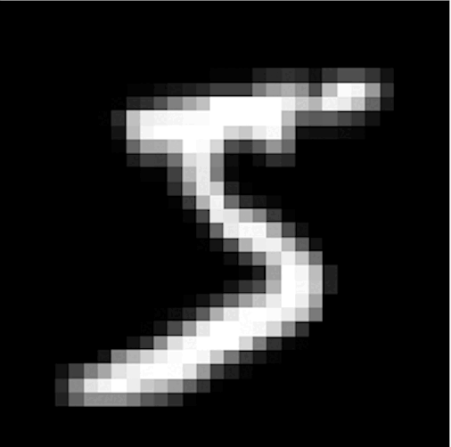
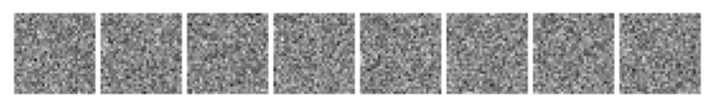
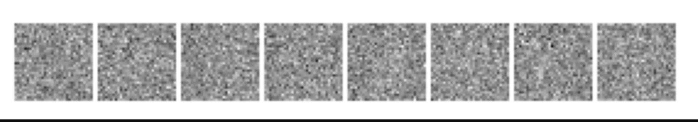
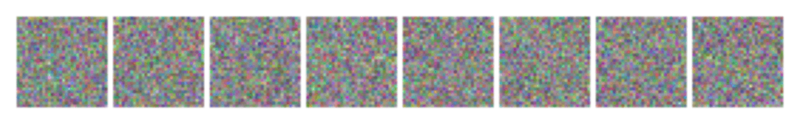
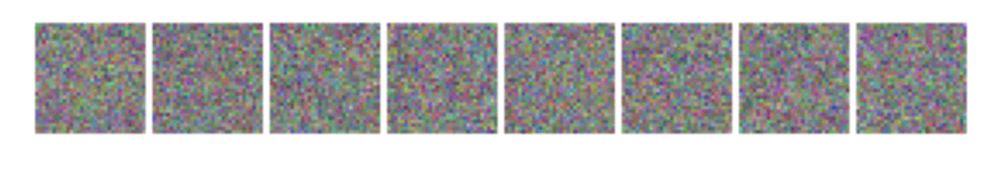
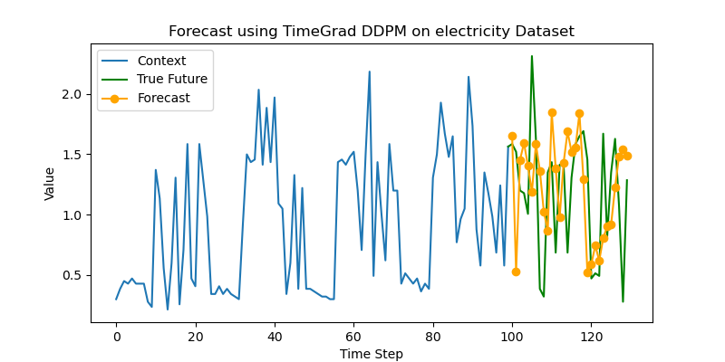

# Tiny Diffusion: Denoising Diffusion Models

A minimal PyTorch implementation of denoising diffusion probabilistic models (DDPM) applied to various datasets, including 2D data, images, audio spectrograms, and time series data.

## Overview

We extended a base diffusion model implementation to work on different modalities:

- **Image Generation**: Training diffusion models on MNIST, Fashion-MNIST, Cats Dataset ([Kaggle](https://www.kaggle.com/datasets/borhanitrash/cat-dataset)), and Flickr Faces Dataset ([Kaggle](https://www.kaggle.com/datasets/imcr00z/flickr-faces-70k-thumbnails-128x128)).
- **Audio Generation**: Mimicking diffusion-based denoising to generate digit spoken audios by training on Mel spectrograms using the Speech Commands Dataset ([Hugging Face](https://huggingface.co/datasets/google/speech_commands)).
- **Time Series Forecasting**: Experimenting with electricity demand forecasting using GluonTS datasets and RNN-based models.

## Getting Started
Get started by running python ddpm.py -h to explore the available options for training.

### Example
To train the model on MNIST:
```bash
python ddpm.py --dataset mnist --epochs 20 --experiment_name mnist_base
```
For training on other datasets, specify the appropriate dataset flag (circle, dino, line, moons, mnist, fashion-mnist, pets, faces,  speech-commands)


## Diffusion Process

### Forward Process
The forward process progressively adds noise to the data until it resembles pure noise.



### Reverse Process
The model learns to reverse the noise, reconstructing samples from the learned distribution.



## Experiments

### Image Datasets
We tested our model on grayscale and RGB datasets:
- MNIST & Fashion-MNIST

- Cats Dataset
  
- Flickr Faces Dataset
  

### Audio Spectrograms
We adapted our model to generate spoken digit audio by denoising Mel spectrograms from the Command Speech Dataset.

### Time Series Forecasting
Inspired by the success of diffusion models in generative tasks, we experimented with time series forecasting using GluonTS datasets and an RNN-based approach.

<div align="center">
    
</div>

## Ablations
We have run a series of ablations experiments on hyperparameters, such as learning rate and noise scheduling, and visualized the learning process. 
The columns in the graphs represent the checkpoint epoch, and the rows indicate the hyperparameter values. Please refer to 
```bash
ablations.ipynb
```
to see the results.

## References

- [project-tiny-diffusion](https://github.com/dataflowr/Project-tiny-diffusion/tree/master#dl-diy-potential-project-ideas)
- [HuggingFace Diffusers](https://github.com/huggingface/diffusers)
- [Jonathan Ho's DDPM](https://github.com/hojonathanho/diffusion)
- [Lucidrains' DDPM PyTorch](https://github.com/lucidrains/denoising-diffusion-pytorch)
- [Denoising Diffusion Probabilistic Model (DDPM) using PyTorch](https://github.com/randomaccess2023/MG2023/tree/main/Video%2052)
- [Datasaurus Dozen](https://www.autodesk.com/research/publications/same-stats-different-graphs) 
- [GluonTS for Time Series](https://ts.gluon.ai/)
- [Cats datasets](https://www.kaggle.com/datasets/borhanitrash/cat-dataset)
- [Flickr Faces Dataset](https://www.kaggle.com/datasets/imcr00z/flickr-faces-70k-thumbnails-128x128)
- [Noise2Music: Text-conditioned Music Generation with Diffusion Models](https://arxiv.org/abs/2306.05284)
- [Deep Unsupervised Learning using Nonequilibrium Thermodynamics](https://arxiv.org/abs/1503.03585)
- [The Rise of Diffusion Models in Time-Series Forecasting](https://arxiv.org/abs/2401.03006)
- [Autoregressive Denoising Diffusion Models for Multivariate Probabilistic Time Series Forecasting](https://arxiv.org/abs/2101.12072)

---

